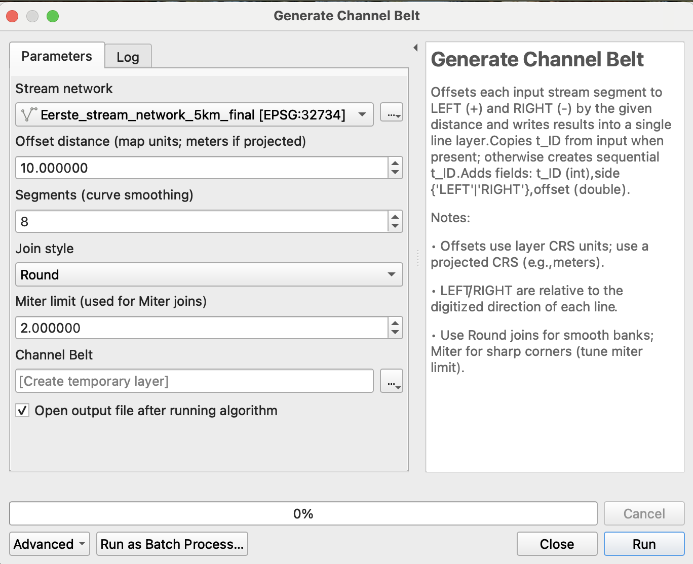
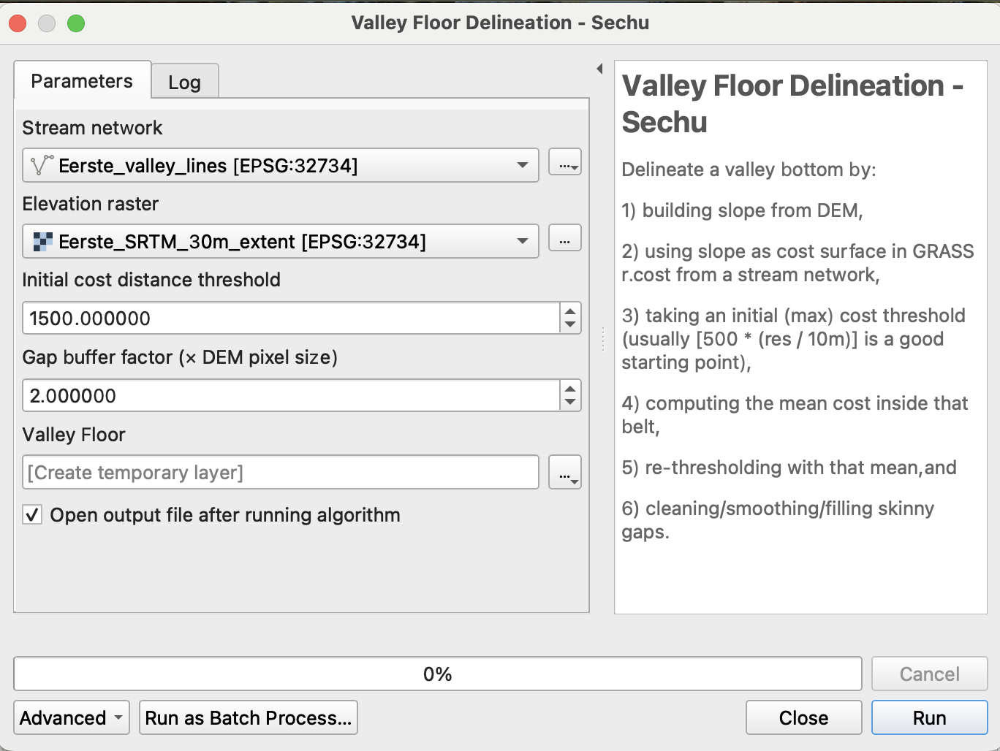
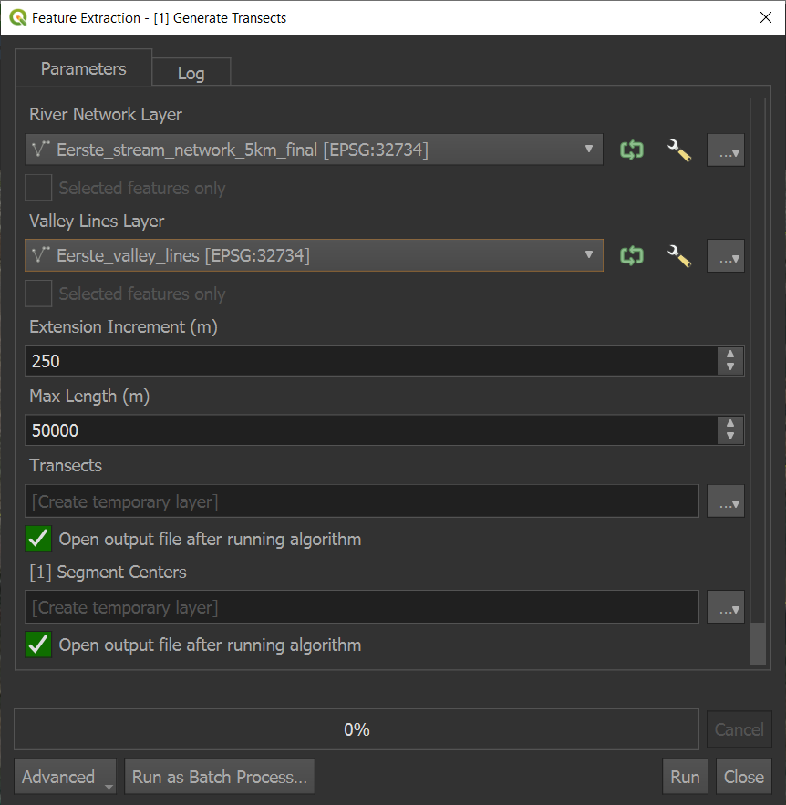
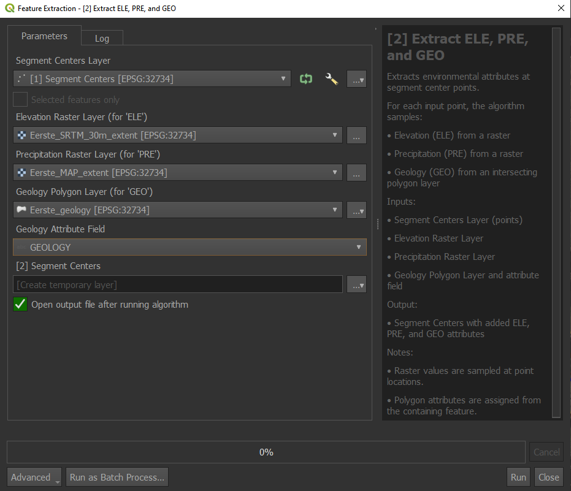
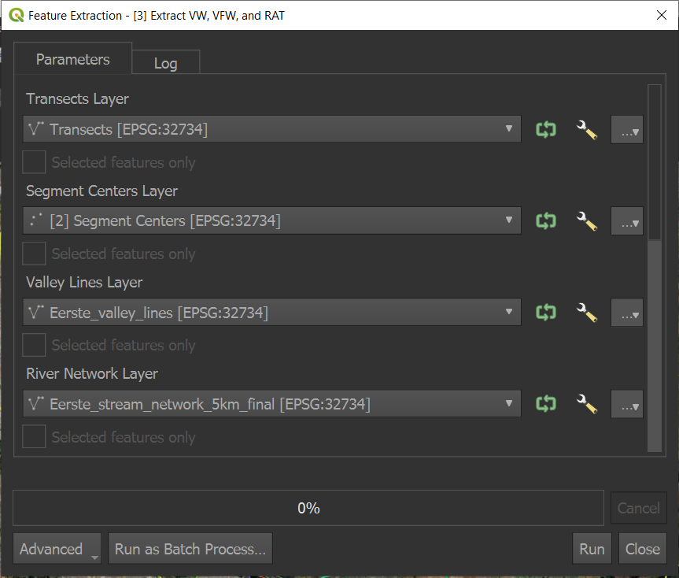
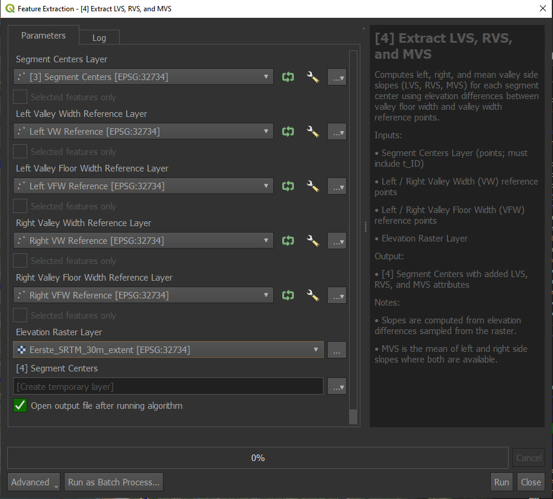
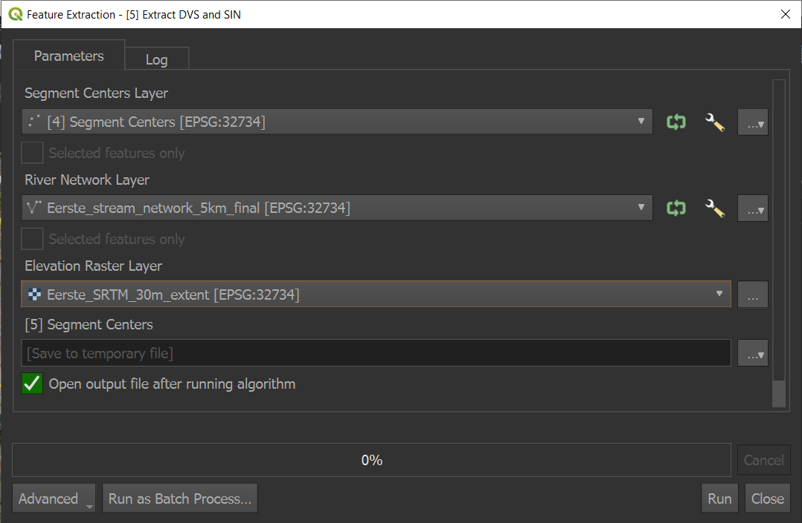
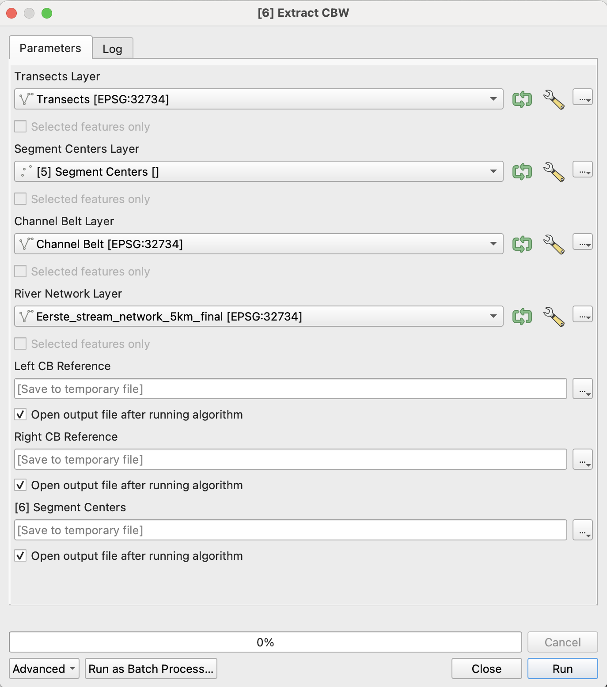
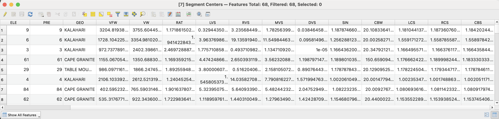

# Open Riverine Ecosystem Synthesis (OpenRES):

## A QGIS plugin for automated extraction of hydrogeomorphic features to support functional process zone classification of river networks

[](https://github.com/ellerbrock/open-source-badges/) [](https://www.python.org/) [](%5Bhttps://www.gnu.org/licenses/old-licenses/gpl-3.0.html%5D(https://www.gnu.org/licenses/gpl-3.0.html#license-text)) [](https://doi.org/10.5281/zenodo.17641964) [](https://plugins.qgis.org/plugins/OpenRES) [](https://github.com/jollygoodjacob/OpenRES/releases) [](https://github.com/jollygoodjacob/OpenRES/commits) [](https://GitHub.com/jollygoodjacob/OpenRES/graphs/commit-activity)

## Citation

If you use this plugin in your work, please cite it as:

> **Cite:** Nesslage, J., & Hestir, E. (2026). OpenRES (Open Riverine Ecosystem Synthesis): A QGIS plugin for automated extraction of hydrogeomorphic features to support functional process zone classification of river networks (Version 1.2.0) [Software]. Zenodo. <https://doi.org/10.5281/zenodo.17641964>

``` bibtex
@software{nesslage2026OpenRES,
  author       = {Nesslage, Jacob and
                  Hestir, Erin},
  title        = {OpenRES (Open Riverine Ecosystem Synthesis): A
                   QGIS plugin for automated extraction of
                   hydrogeomorphic features to support functional
                   process zone classification of river networks
                  },
  month        = jan,
  year         = 2026,
  publisher    = {Zenodo},
  version      = {v1.2.0},
  doi          = {10.5281/zenodo.17641964},
  url          = {https://doi.org/10.5281/zenodo.17641964}
}
                
```

## General Information

**OpenRES** enables QGIS users to extract up to fifteen physical and environmental features along river segments (typically 5--10 km) to support classification of river networks into **Functional Process Zones (FPZs)**.

**Functional Process Zone (FPZ)** classification is a method used to divide a river network into river valley scale (5-10 km) segments (or "zones") that share similar physical, hydrological, and geomorphic characteristics. Rather than treating a river as a continuous longitudinal gradient of changing physical conditions, FPZ classification recognizes that rivers are composed of a discontinuous set of hydrogeomorphic patches, each shaped by different landscape and hydrologic processes ([Hestir 2007](https://www.researchgate.net/profile/Erin-Hestir/publication/265026989_Functional_Process_Zones_and_the_River_Continuum_Concept/links/546248c00cf2c0c6aec1ade8/Functional-Process-Zones-and-the-River-Continuum-Concept.pdf)). These zones reflect how the river behaves in a given segment, including how it flows, how it transports sediment, how it interacts with its floodplain, and what types of habitats it supports.

After classifying a river network in FPZs, research questions posed by the tenets of the Riverine Ecosystem Synthesis hypothesis ([Thorp et al. 2006](https://onlinelibrary.wiley.com/doi/abs/10.1002/rra.901), [Thorp et al. 2023](https://www.frontiersin.org/journals/ecology-and-evolution/articles/10.3389/fevo.2023.1184433/full)) can be explored.

------------------------------------------------------------------------

## Installation

> **Note:** OpenRES requires QGIS version \>=3.28.

**Installation from QGIS:**

-   Open QGIS -\> Plugins -\> Manage and Install Plugins... -\> select All tab -\> search for OpenRES --\> select and install plugin

**Offline installation from .zip file** :

-   Go to releases of this repository -\> select desired version -\> download the .zip file.

-   Open QGIS -\> Plugins -\> Manage and Install Plugins... -\> install from ZIP tab --\> select the downloaded zip --\> install plugin (ignore warnings, if any).

------------------------------------------------------------------------

## Data Prerequisites

Users should prepare the following **six datasets** for your watershed of interest. Use consistent CRS and units (projected meters recommended, e.g., UTM) for all layers.

| Dataset                                           | Format | Description                                                                                                                                                                                                                                                                                                                                                                  |
|---------------------------------------------------|--------|------------------------------------------------------------------------------------------------------------------------------------------------------------------------------------------------------------------------------------------------------------------------------------------------------------------------------------------------------------------------------|
| **Mean Annual Precipitation Layer**               | `.tif` | Raster of mean annual precipitation for the watershed.                                                                                                                                                                                                                                                                                                                       |
| **Digital Elevation Model (DEM) Layer**           | `.tif` | Elevation raster used for slopes, valley floors, and longitudinal gradients.                                                                                                                                                                                                                                                                                                 |
| **Simplified Geology Layer**                      | `.shp` | Polygon layer with generalized classes (e.g., alluvial, mixed, bedrock). Typically a simplified version of a detailed map.                                                                                                                                                                                                                                                   |
| **Geomorphically Corrected Stream Network Layer** | `.shp` | Stream lines generated from the DEM and manually corrected to follow observed channel positions in imagery for the analysis period (Whitebox Workflows recommended here).                                                                                                                                                                                                    |
| **Valley-Boundary Line Layer**                    | `.shp` | Lines delineating both the valley floor boundary and valley-edge boundary. Suggested workflow: (1) delineate valley floor, (2) edit to remove holes and unrealistic extents, (3) derive 1-2 km² microsheds/isobasins from the DEM (Whitebox Workflows recommended here), (4) apply intersection/difference/polygon-to-line to extract combined boundaries as a line feature. |
| **Channel Belt Layer**                            | `.shp` | Lines delineating the channel belt (active/recent fluvial influence, including channel and depositional features). Suggested workflow: (1) OpenRES → Geomorphology Tools → Generate Channel Belt, (2) manual refinement to match meanders and depositional forms visible in imagery.                                                                                         |

Some of these layers may not be very common for most river systems (especially the **Valley-Boundary Line Layer** and **Channel Belt Layer**). For these less common datasets, `OpenRES` provides several geomorphology utility tools to allow users to create these datasets for their watershed of interest.

**Data quality tips**

-   Ensure all inputs share the same projected CRS and unit (meters)

-   Snap and clean linework to avoid sliver gaps that can break intersections

------------------------------------------------------------------------

## Core Functionality

**OpenRES** provides geomorphology utilities to prepare key boundary layers and a set of sequential extraction tools that produce a standard suite of **15 hydrogeomorphic attributes** for FPZ classification.

### Geomorphology Tools

Use these tools to produce your **Valley-Boundary Line Layer** and **Channel Belt** .

**Generate Channel Belt** Creates left/right offsets from the stream network to approximate the active or recently active channel zone, merges offsets, and produces a single line layer. Users should refine the result to match visible channel-belt edges. Outputs are used later for Channel Belt Width (CBW) and Channel Belt Sinuosity (CBS).

**Valley Floor Delineation - Sechu** Implements a modified cost-accumulation approach to delineate valley floors from a DEM (Sechu et al., 2021). The method propagates outward from the channel until a slope threshold is reached, separating low-relief valley bottoms from confining walls. The polygon output can be edited and converted to the linework needed for valley-boundary intersections.

### Data Extraction Tools

Run these tools in order. Together, they generate all attributes required for FPZ classification.

| Step                          | What it does                                                                                                                                                                                          | Key outputs                        |
|-------------------------------|-------------------------------------------------------------------------------------------------------------------------------------------------------------------------------------------------------|------------------------------------|
| **[1] Generate Transects**    | Creates perpendicular transects from each stream segment to the valley edges. Iteratively extends per side until two intersections per side are found, ensuring complete valley cross-sections.       | `t_ID`, transects, segment centers |
| **[2] Extract ELE, PRE, GEO** | Samples elevation (DEM), precipitation (climate raster), and geology (polygon) at segment centers to capture environmental gradients.                                                                 | `ELE`, `PRE`, `GEO`                |
| **[3] Extract VW, VFW, RAT**  | Measures **Valley Floor Width (VFW)** and **Valley Width (VW)** using first and second intersections of transects with valley boundaries. Computes **RAT = VW / VFW** to quantify valley confinement. | `VFW`, `VW`, `RAT`                 |
| **[4] Extract LVS, RVS, MVS** | Calculates **Left (LVS)** and **Right (RVS)** valley slopes from elevation differences between valley tops and floors; averages them to obtain **Mean Valley Slope (MVS)**.                           | `LVS`, `RVS`, `MVS`                |
| **[5] Extract DVS and SIN**   | Derives **Down-Valley Slope (DVS)** from start and end elevations of each stream segment and computes **River Sinuosity (SIN)** as the ratio of true channel length to straight-line distance.        | `DVS`, `SIN`                       |
| **[6] Extract CBW**           | Measures **Channel Belt Width (CBW)** as the distance between first left and right transect intersections with the channel belt line layer.                                                           | `CBW`                              |
| **[7] Extract LCS, RCS, CBS** | Calculates **Left (LCS)** and **Right (RCS)** Channel Sinuosity within the channel belt; averages both to derive **Channel Belt Sinuosity (CBS)**.                                                    | `LCS`, `RCS`, `CBS`                |

------------------------------------------------------------------------

## Example usage: Eerste River catchment, South Africa

> **Note:** All the following processing steps should be done in a sequential manner, following the instructions below. Sample data for hydrogeomorphic feature extraction is provided in [sample_data](/sample_data/) folder.

To demonstrate the use of OpenRES, we have provided a dataset from the Eerste River catchment, a small watershed located in the Greater Cape Floristic Region of South Africa.

::: {align="center"}
<br> <sub><b> Eerste River catchment, South Africa</b></sub>
:::

The Eerste River originates in the Jonkershoek Mountains, part of the Hottentots-Holland mountain range, and flows westward through the Stellenbosch area before reaching the False Bay coast near Strand. It drains a catchment area of approximately 390 km². Dominated by fynbos vegetation, the area hosts numerous endemic plant species and is under increasing pressure from urban development, invasive species, and agricultural runoff.

------------------------------------------------------------------------

### Prerequisites

Before starting the OpenRES workflow:

-   Ensure all input data are properly prepared:
    -   Stream network (.shp)
    -   Valley boundaries (.shp)
    -   Elevation raster (.tif)
    -   Precipitation raster (.tif)
    -   Geology polygons with a classification field (e.g., `LITH`, `TYPE`, or `GEO`) (.shp)
    -   Channel belt layer (.shp)
-   The **OpenRES** plugin is installed and enabled in QGIS.
-   The **Processing Toolbox** is open (via `Processing > Toolbox`).

::: {align="center"}
<br> <sub><b> The OpenRES Processing Toolbox</b></sub>
:::

------------------------------------------------------------------------

### Using the Geomorphology Tool to Prepare Input Data

#### Generate Channel Belt Layer

Use `"Generate Channel Belt"`\

Location: `Processing Toolbox > OpenRES > Geomorphology`

::: {align="center"}

:::

##### Inputs

-   **River Network Layer** (polyline)

##### Outputs

-   **Channel Belt Layer**

##### Notes

-   Offsets each input stream segment to LEFT (+) and RIGHT (-) by the given distance.
-   Offsets use layers CRS; use a projected CRS (e.g., meters).
-   LEFT/RIGHT are relative to the digitized direction of each line
-   Use `Round` join style for smooth banks; `Miter` for sharp corners (user will have to tune miter limit).
-   Copies `t_ID` from input if present, otherwise creates sequential `t_ID`.
-   Adds fields `t_ID` (int), `side` {'LEFT'\|'RIGHT'}, `offset` (double).

#### Delineate Valley Floor

Use `"Valley Floor Delineation - Sechu"`

Location: `Processing Toolbox > OpenRES > Geomorphology`

::: {align="center"}

:::

##### Inputs

-   **River Network Layer** (polyline)
-   **Elevation Raster**

##### Outputs

-   **Valley Floor Layer** (MultiPolygon)

##### Notes

-   Delineates valley bottom by building slope from DEM, using slope as cost surface in GRASS r.cost from a stream network, taking an initial (max) cost threshold, computing mean cost inside that belt, re-thresholding with that mean, and cleaning, smoothing and filling skinny gaps.
-   Initial cost distance threshold: `[500*(resolution/10m)]` is a good starting point

------------------------------------------------------------------------

### Overview of Extracted Features

The following table summarizes the nine geomorphic and environmental features that will be automatically derived across the Eerste River catchment using the OpenRES tool suite. Each transect, generated perpendicular to the stream network, will be assigned a unique identifier `t_ID`, and the attributes listed below will be extracted or calculated at the transect or segment level. Transects, segment centers, and the river network segments are all linked together by the `t_ID` field, enabling subsequent FPZ classification methods to link using joins and relates to the stream network, river segment centers, or transects as desired for visualization purposes.

| Step | Feature                      | Attribute Code |
|------|------------------------------|----------------|
| 1    | Transects & segment centers  | `t_ID`         |
| 2    | Elevation                    | `ELE`          |
| 2    | Precipitation                | `PRE`          |
| 2    | Geology class                | `GEO`          |
| 3    | Valley Floor Width           | `VFW`          |
| 3    | Valley Width                 | `VW`           |
| 3    | Ratio of VW and VFW          | `RAT`          |
| 4    | Left/Right Valley Slope      | `LVS`, `RVS`   |
| 4    | Mean Valley Slope            | `MVS`          |
| 5    | Down-Valley Slope            | `DVS`          |
| 5    | Sinuosity                    | `SIN`          |
| 6    | Channel Belt Width           | `CBW`          |
| 7    | Left/Right Channel Sinuosity | `LCS`, `RCS`   |
| 7    | Channel Belt Sinuosity       | `CBS`          |

------------------------------------------------------------------------

### Step 1: Generate Transects

Use: `"[1] Generate Transects"`\
Location: `Processing Toolbox > OpenRES > Feature Extraction`

::: {align="center"}

:::

#### Inputs

-   **River Network Layer** (polyline)
-   **Valley Lines Layer** (line)
-   **Extension Increment** (optional, default = 250m)
-   **Max Length** (optional, default = 50000m)

#### Outputs

-   **Transects** -- Multiline layer across the valley
-   **Segment Centers** -- Points at the center of each transect

#### Notes

-   Each river segment gets a unique `t_ID`.
-   Transects are generated perpendicular to the river segment direction.
-   **Verify** that transects intersect both valley lines properly; occasional mismatches may occur due to geometry errors.
-   Stream network will also be updated to include the `t_ID` field.

------------------------------------------------------------------------

### Step 2: Extract Elevation, Precipitation, and Geology

Use: `"[2] Extract Point Data"`\
Location: `Processing Toolbox > OpenRES > Feature Extraction`

::: {align="center"}

:::

#### Inputs

-   **Segment Centers Layer** (from Step 1)
-   **Elevation Raster**
-   **Precipitation Raster**
-   **Geology Polygon Layer**
-   **Geology Field** (attribute from polygon layer, e.g., `GEO` or `LITH`)

#### Output

-   **Segment Centers with ELE, PRE, GEO** -- Updated point layer

#### Notes

-   Elevation and precipitation are sampled directly from rasters.
-   Geology is assigned from intersecting polygon based on the selected field.
-   Missing data (e.g., no polygon overlap or invalid raster) will be filled with fallback values (e.g., -9999 or "No Data").

------------------------------------------------------------------------

### Step 3: Extract Valley Width (VW), Valley Floor Width (VFW), and their ratio (RAT)

Use: `"[3] Extract VW, VFW", and RAT`\
Location: `Processing Toolbox > OpenRES > Feature Extraction`

::: {align="center"}

:::

#### Inputs

-   **Transects Layer** (from Step 1)
-   **Segment Centers Layer** (from Step 2)
-   **Valley Lines Layer**
-   **Stream Network Layer**

#### Outputs

-   **Left/Right VFW Reference Points**
-   **Left/Right VW Reference Points**
-   **Updated Segment Centers** with:
    -   `VFW` -- Valley floor width
    -   `VW` -- Valley width

#### Notes

-   Uses intersection logic to find points where transects intersect valley floor and valley edge.
-   Then calculates distance between these intersections to compute `VFW` and `VW`.
-   Reference points (left/right) are saved as point layers for inspection or QA/QC.

------------------------------------------------------------------------

### Step 4: Extract Side Slopes (LVS, RVS, and MVS)

Use: `"[4] Extract LVS, RVS, and MVS"`\
Location: `Processing Toolbox > OpenRES > Feature Extraction`

::: {align="center"}

:::

#### Inputs

-   **Segment Centers Layer** (from Step 3)
-   **Left VW / VFW Reference Points**
-   **Right VW / VFW Reference Points**
-   **Elevation Raster**

#### Output

-   **Segment Centers** updated with:
    -   `LVS` -- Left valley side slope (%)
    -   `RVS` -- Right valley side slope (%)

#### Notes

-   Slopes are computed as the elevation difference between VFW and VW reference points on each side divided by the horizontal distance.
-   All calculations are in percent slope (`rise/run * 100`).
-   Output replaces the segment center layer with updated slope fields.

------------------------------------------------------------------------

### Step 5: Extract Down-Valley Slope and Sinuosity (DVS and SIN)

Use: `"[5] Extract DVS and SIN"`\
Location: `Processing Toolbox > OpenRES > Feature Extraction`

::: {align="center"}

:::

#### Inputs

-   **Segment Centers Layer** (from Step 4)
-   **Stream Network Layer**
-   **Elevation Raster**

#### Output

-   **Segment Centers** updated with:
    -   `DVS` -- Down-valley slope (%)
    -   `SIN` -- Sinuosity (unitless)

#### Notes

-   For each stream segment:
    -   Elevation is sampled at start and end points.
    -   `DVS` is calculated as `(start - end) / length * 100`.
    -   `SIN` is the ratio of actual segment length to straight-line distance.
-   Features with insufficient geometry or elevation data are skipped.

### Step 6: Extract Channel Belt Width (CBW)

Use: `"[6] Extract CBW"\  Location:`Processing Toolbox \> OpenRES \> Feature Extraction\`

::: {align="center"}

:::

#### Inputs

-   **Transects Layer**
-   **Segment Centers Layer** (from Step 5)
-   **Channel Belt Layer** (may be generated from `Geomorphology > Generate Channel Belt`
-   **River Network Layer**

#### Output

-   **Left Channel Belt Width Reference**
-   **Right Channel Belt Width Reference**
-   **Segment Centers** updated with: - Channel belt width

#### Notes

-   Uses intersection logic to find points where transects intersect the channel belt right and left reference.
-   Then calculates distance between these intersections to compute 'CBW'.
-   Reference points (left/right) are saved as point layers for inspection or QA/QC.

### Step 7: Extract Left, Right and Center Channel Sinuosity

Use: `"[7] Extract LCS, RCS, and CBS"`\
Location: `Processing Toolbox > OpenRES > Feature Extraction`

#### Inputs

-   **Transects Layer**
-   **Segment Centers Layer** (from Step 5)
-   **Channel Belt Layer** (may be generated from `Geomorphology > Generate Channel Belt`)
-   **River Network Layer**

#### Output

-   **Left Channel Sinuoisty** (LCS)
-   **Right Channel Sinuosity** (RCS)
-   **Channel Belt Sinuosity** (CBS)
-   **Segment Centers** updated with:
    -   Left channel sinuoisty
    -   Right channel sinuoisty
    -   Channel belt sinuosity

------------------------------------------------------------------------

### Completion

At the end of Step 7, your segment center point layer will contain **all 15 hydrogeomorphic attributes**:

-   `t_ID`, `ELE`, `PRE`, `GEO`, `VFW`, `VW`, `RAT`,`LVS`, `RVS`,`MVS`, `DVS`, `SIN`, `CBW`, `LCS`, `RCS`, `CBS`

::: {align="center"}

:::

------------------------------------------------------------------------

## Issues

1)  Report issues or problems with the software here: <https://github.com/jollygoodjacob/OpenRES/issues>

2)  For questions about the OpenRES plugin, contact: [jnesslage\@ucmerced.edu](mailto:jnesslage@ucmerced.edu){.email}

## References

Elgueta, Anaysa, Martin C Thoms, Konrad Górski, Gustavo Díaz, and Evelyn M Habit. 2019. "Functional Process Zones and Their Fish Communities in Temperate Andean River Networks." River Research and Applications 35 (10): 1702--11.

Hestir, Erin L. 2007. "Functional Process Zones and the River Continuum Concept." Center for Watershed Sciences, University of California, Davis, Los Angeles, USA.

Maasri, Alain, James H Thorp, Jon K Gelhaus, Flavia Tromboni, Sudeep Chandra, and Scott J Kenner. 2019. "Communities Associated with the Functional Process Zone Scale: A Case Study of Stream Macroinvertebrates in Endorheic Drainages." Science of the Total Environment 677: 184--93.

Sechu, Gasper L., Bertel Nilsson, Bo V. Iversen, Mette B. Greve, Christen D. Børgesen, and Mogens H. Greve. 2021. "A Stepwise GIS Approach for the Delineation of River Valley Bottom within Drainage Basins Using a Cost Distance Accumulation Analysis." *Water* 13 (6). <https://doi.org/10.3390/w13060827>.

Thorp, James H, Martin C Thoms, and Michael D Delong. 2006. "The Riverine Ecosystem Synthesis: Biocomplexity in River Networks across Space and Time." River Research and Applications 22 (2): 123--47.

Thorp, James H, Martin C Thoms, and Michael D Delong. 2010. The Riverine Ecosystem Synthesis: Toward Conceptual Cohesiveness in River Science. Elsevier.

Thorp, James H, Martin C Thoms, Michael D Delong, and Alain Maasri. 2023. "The Ecological Nature of Whole River Macrosystems: New Perspectives from the Riverine Ecosystem Synthesis." Frontiers in Ecology and Evolution 11: 1184433.

Williams, Bradley S, Ellen D'Amico, Jude H Kastens, James H Thorp, Joseph E Flotemersch, and Martin C Thoms. 2013. "Automated Riverine Landscape Characterization: GIS-Based Tools for Watershed-Scale Research, Assessment, and Management." Environmental Monitoring and Assessment 185: 7485--99.
