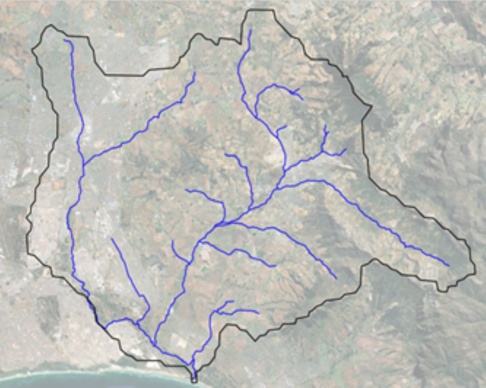
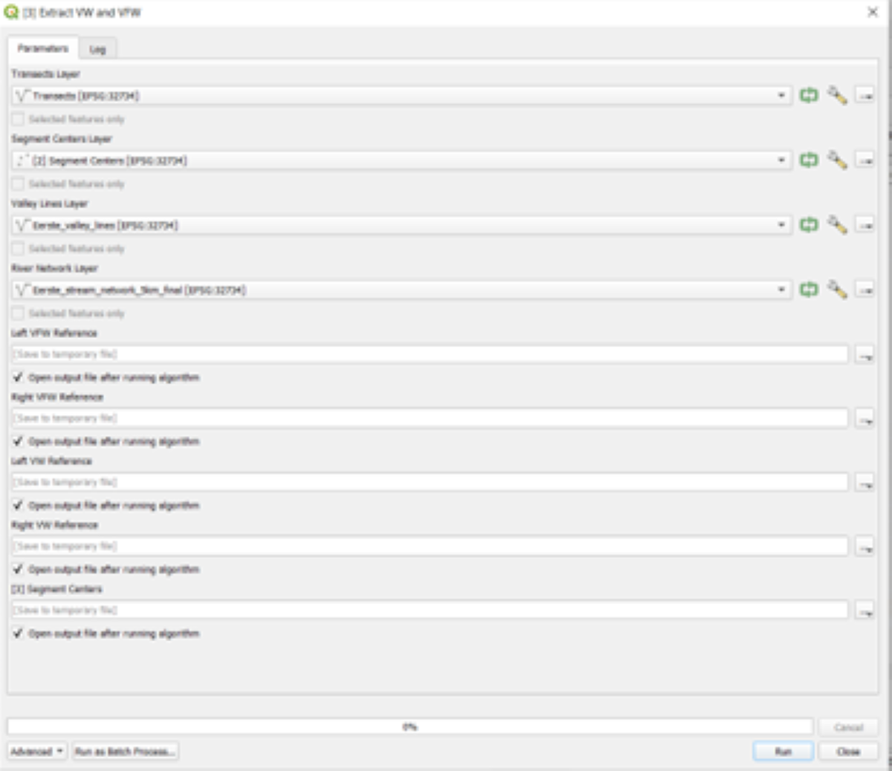

# Open Riverine Ecosystem Synthesis (OpenRES):

## A [QGIS](https://qgis.org/en/site/index.html) plugin for automated extraction of hydrogeomorphic features to support functional process zone classification of river networks

## Citation

If you use this plugin in your work, please cite it as:

## General Information

**OpenRES** enables QGIS users to extract nine required physical and environmental features along river segments (typically 5–10 km) to support classification of river networks into **Functional Process Zones (FPZs)**.  

**Functional Process Zone (FPZ)** classification is a method used to divide a river network into river valley scale (5-10 km) segments (or "zones") that share similar physical, hydrological, and geomorphic characteristics. Rather than treating a river as a continuous longitudinal gradient of changing physical conditions, FPZ classification recognizes that rivers are composed of a discontinuous set of hydrogeomorphic patches, each shaped by different landscape and hydrologic processes ([Hestir 2007](https://www.researchgate.net/profile/Erin-Hestir/publication/265026989_Functional_Process_Zones_and_the_River_Continuum_Concept/links/546248c00cf2c0c6aec1ade8/Functional-Process-Zones-and-the-River-Continuum-Concept.pdf)). These zones reflect how the river behaves in a given segment, including how it flows, how it transports sediment, how it interacts with its floodplain, and what types of habitats it supports. After classifying a river network in FPZs, research questions posed by the tenets of the Riverine Ecosystem Synthesis hypothesis ([Thorp et al. 2006](https://onlinelibrary.wiley.com/doi/abs/10.1002/rra.901), [Thorp et al. 2023](https://www.frontiersin.org/journals/ecology-and-evolution/articles/10.3389/fevo.2023.1184433/full)) can be explored.

## Data Prerequisites

There are five required datasets needed prior to the extraction of hydrogeomorphic features along a user's watershed of interest using **OpenRES** in QGIS:

- **A geomorphically corrected stream network (.shp)**: This is a stream network generated using Whitebox Tools or another hydrological toolbox in QGIS from a DEM, which is then manually corrected to ensure that the stream network follows the course of the river as observed from imagery during the time period of interest. The stream network should be a MultiLineString object, the river segments should be segmented to a user-defined length (usually 5km-10km for FPZs), and it is recommended that the user smooth the final river network to reduce the likelihood of erroneous transect generation prior to use in OpenRES.
- **A line layer denoting the boundaries of the valley floor and the valleys (.shp)**: This layer is a line layer that contains the boundaries of both the valley bottom and the microsheds/isobasins that intersect with the valley bottom. The general procedure for producing this layer is described fully in [Williams et al. 2013](https://link.springer.com/article/10.1007/s10661-013-3114-6); however, the steps include 1.) delineating the valley bottom using a flooding algorithm (MRVBF, FLDPLN) or slope thresholding algorithm (VBET-2, Sechu et al. 2021), 2.) manual interpretation and edits to the valley bottom output to fix holes and ensure that the valley bottoms conform to expectations, 3.) generation of 1 km2 - 2 km2 "microsheds" or "isobasins" across your DEM, and 4.) various vector opertations (intersection, difference, polygon to line) to obtain a line layer that contains both the valley floor boundaries and the boundaries of intersecting microsheds that overlap with the valley floor boundaries. Thus, this layer approximates the boundaries of the valley floor and the tops of the valley that confines the river network.
- **A mean annual precipitation layer (.geotiff)**: This is a rasterized mean annual precipitation layer. Examples include but are not limited to the PRISM dataset (800m) in the U.S. or WorldClim (5km) for global studies.
- **A Digital Elevation Model (DEM) (.geotiff)**: This is a digital elevation model of the watershed of interest, often obtained from remote sensing platforms. Common datasets include 30m SRTM (global) DEMs or the 10m 3DEP (U.S.) DEMs.
- **A geology layer (.shp)**: This is a geology polygon layer that contains geologic classification of surficial or underlying geology. Often, this layer is a simplified version of the source geology layer that is classified into bedrock, mixed, or alluvial classes. In the U.S., these can be obtained from USGS; internationally, most governments can provide a publically accessible vector dataset for this analysis.

## Core Functionality 

As of this version of the plugin, the core function of OpenRES is to provide the minimal number of required features necessary to delineate FPZs from river networks. The nine required features historically used to define Functional Process Zones along river segments (see [Williams et al. 2013](https://link.springer.com/article/10.1007/s10661-013-3114-6)) are:

-   **Elevation (ELE)**: Elevation value (often in meters), extracted from the center of each stream segment.
-   **Mean Annual Precipitation (PRE)**: Mean annual precipitation value (often in mm), extracted from the center of each stream segment.
-   **Geology (GEO)**: Geology field value, extracted from the center of each stream segment.
-   **Valley Floor Width (VFW)**: Width (in meters) between the first intersections of the transects for each stream segment on the left and right sides of the stream and the valley line layer. When correctly generated, the first intersection of the valley line layer should correspond with the boundaries of the valley floor.      
-   **Valley Width (VW)**: Width (in meters) between the second intersections of the transects for each stream segment on the left and right sides of the stream and the valley line layer. When correctly generated, the second intersection of the valley line layer should correspond with tops of hydrologically connected basins that intersect the valley floor, which approximates the tops of valleys. 
-   **Right Valley Slope (RVS)**: Slope (in degrees) between the first and second intersection of a transect with the valley line layer on the right side of the river, as defined from a downstream direction. This essentially is the slope between the tops of the valley and the valley bottom on the right side of the river.
-   **Left Valley Slope (LVS)**: Slope (in degrees) between the first and second intersection of a transect with the valley line layer on the left side of the river, as defined looking downstream. This essentially is the slope between the tops of the valley and the valley bottom on the left side of the river.
-   **Down Valley Slope (DVS)**: The slope (in degrees) between the starting point and endpoint of a given stream segment.
-   **Sinuosity (SIN)**: The ratio of the true stream distance and the straight line distance between the starting point and endpoint of a given stream segment.

These nine features can then be used to classify stream networks using unsupervised hierarchical classification methods (see examples in [Thorp et al. 2010](https://books.google.com/books?hl=en&lr=&id=9N9rz8YH_u0C&oi=fnd&pg=PP1&dq=thorp+et+al+2010&ots=eBk_vZsNWA&sig=1XQ2cIyXRnD_t4t1MOtwe6xpQDQ#v=onepage&q=thorp%20et%20al%202010&f=false), [Elgueta et al. 2019](https://onlinelibrary.wiley.com/doi/full/10.1002/rra.3557), [Maasri et al. 2021](https://onlinelibrary.wiley.com/doi/full/10.1002/rra.3784)). The classes obtained using these methods define stream segments that share similar physical, hydrological, and geomorphic characteristics. 

Future versions of **OpenRES** will likely extend the number of features to include optional features, such as the ratio of valley width to valley floor width (RAT), channel belt sinuosity (CBD), the valley confinement index (VCI), and other miscellaneous tools to aid users in producing the required datasets.

## Installation

> **Note:** OpenRES requires QGIS version \>=3.28.

**Offline installation from .zip file** :

-  Go to releases of this repository -\> select desired version -\>
download the .zip file. 

-   Open QGIS -\> Plugins -\> Manage and Install
Plugins... -\> install from ZIP tab --\> select the downloaded zip --\>
install plugin (ignore warnings, if any).

## Example usage: Eerste River catchment, South Africa

> **Note:** All the following processing steps should be done in a
> sequential manner, following the instructions below. Sample data for hydrogeomorphic feature extraction
> is provided in [sample_data](/sample_data/) folder.

To demonstrate the use of OpenRES, we have provided a dataset from the Eerste River catchment, a small watershed located in the Greater Cape Floristic Region of South Africa. 

  

The Eerste River originates in the Jonkershoek Mountains, part of the Hottentots-Holland mountain range, and flows westward through the Stellenbosch area before reaching the False Bay coast near Strand. It drains a catchment area of approximately 390 km². Dominated by fynbos vegetation, the area hosts numerous endemic plant species and is under increasing pressure from urban development, invasive species, and agricultural runoff.

---

### Prerequisites

Before starting the OpenRES workflow:

-  Ensure all input data are properly prepared:
  - Stream network (polyline)
  - Valley boundaries (lines)
  - Elevation raster (DEM)
  - Precipitation raster
  - Geology polygons with a classification field (e.g., `LITH`, `TYPE`, or `GEO`)
-  The **OpenRES** plugin is installed and enabled in QGIS.
-  The **Processing Toolbox** is open (via `Processing > Toolbox`).

---

### Overview of Extracted Features

The following nine features will be extracted across the Eerste River catchment using OpenRES tools:

| Step | Feature                | Attribute Code |
|------|------------------------|----------------|
| 1    | Transects & segment centers | `t_ID`         |
| 2    | Elevation              | `ELE`          |
| 2    | Precipitation          | `PRE`          |
| 2    | Geology class          | `GEO`          |
| 3    | Valley Floor Width     | `VFW`          |
| 3    | Valley Width           | `VW`           |
| 4    | Left/Right Side Slope  | `LVS`, `RVS`   |
| 5    | Down-Valley Slope      | `DVS`          |
| 5    | Sinuosity              | `SIN`          |

---

### Step 1: Generate Transects

Use: `"[1] Generate Transects"`  
Location: `Processing Toolbox > OpenRES > Feature Extraction`

  

####  Inputs
- **River Network Layer** (polyline)
- **Valley Lines Layer** (line)
- **Extension Increment** (optional, default = 5m)
- **Max Length** (optional, default = 200m)

####  Outputs
- **Transects** – Multiline layer across the valley
- **Segment Centers** – Points at the center of each transect

####  Notes
- Each river segment gets a unique `t_ID`.
- Transects are generated perpendicular to the river segment direction.
- **Verify** that transects intersect both valley lines properly; occasional mismatches may occur due to geometry errors.
- Stream network will also be updated to include the `t_ID` field.

---

### Step 2: Extract Elevation, Precipitation, and Geology

Use: `"[2] Extract Point Data"`  
Location: `Processing Toolbox > OpenRES > Feature Extraction`

  

####  Inputs
- **Segment Centers Layer** (from Step 1)
- **Elevation Raster**
- **Precipitation Raster**
- **Geology Polygon Layer**
- **Geology Field** (attribute from polygon layer, e.g., `GEO` or `LITH`)

####  Output
- **Segment Centers with ELE, PRE, GEO** – Updated point layer

####  Notes
- Elevation and precipitation are sampled directly from rasters.
- Geology is assigned from intersecting polygon based on the selected field.
- Missing data (e.g., no polygon overlap or invalid raster) will be filled with fallback values (e.g., -9999 or "No Data").

---

###  Step 3: Extract Valley Width (VW) and Valley Floor Width (VFW)

Use: `"[3] Extract VW and VFW"`  
Location: `Processing Toolbox > OpenRES > Feature Extraction`

  

####  Inputs
- **Transects Layer** (from Step 1)
- **Segment Centers Layer** (from Step 2)
- **Valley Lines Layer** (same as Step 1)
- **Stream Network Layer** (same as Step 1)

####  Outputs
- **Left/Right VFW Reference Points**
- **Left/Right VW Reference Points**
- **Updated Segment Centers** with:
  - `VFW` – Valley floor width
  - `VW` – Valley width

####  Notes
- Uses intersection logic to find points where transects intersect valley floor and valley edge.
- Then calculates distance between these intersections to compute `VFW` and `VW`.
- Reference points (left/right) are saved as point layers for inspection or QA/QC.

---

###  Step 4: Extract Side Slopes (LVS and RVS)

Use: `"[4] Extract LVS and RVS"`  
Location: `Processing Toolbox > OpenRES > Feature Extraction`

  

####  Inputs
- **Segment Centers Layer** (from Step 3)
- **Left VW / VFW Reference Points**
- **Right VW / VFW Reference Points**
- **Elevation Raster**

####  Output
- **Segment Centers** updated with:
  - `LVS` – Left valley side slope (%)
  - `RVS` – Right valley side slope (%)

####  Notes
- Slopes are computed as the elevation difference between VFW and VW reference points on each side divided by the horizontal distance.
- All calculations are in percent slope (`rise/run * 100`).
- Output replaces the segment center layer with updated slope fields.

---

###  Step 5: Extract Down-Valley Slope and Sinuosity (DVS and SIN)

Use: `"[5] Extract DVS and SIN"`  
Location: `Processing Toolbox > OpenRES > Feature Extraction`

  

####  Inputs
- **Segment Centers Layer** (from Step 4)
- **Stream Network Layer** (with `t_ID`)
- **Elevation Raster**

####  Output
- **Final OpenRES Segment Centers** with:
  - `DVS` – Down-valley slope (%)
  - `SIN` – Sinuosity (unitless)

####  Notes
- For each stream segment:
  - Elevation is sampled at start and end points.
  - `DVS` is calculated as `(start - end) / length * 100`.
  - `SIN` is the ratio of actual segment length to straight-line distance.
- Features with insufficient geometry or elevation data are skipped.

---

###  Completion

At the end of Step 5, your segment center point layer will contain **all 9 hydrogeomorphic attributes**:

- `t_ID`, `ELE`, `PRE`, `GEO`, `VFW`, `VW`, `LVS`, `RVS`, `DVS`, `SIN`

  

These outputs can now be used for classification, regionalization, ecological modeling, or mapping hydrogeomorphic units.

---

### After OpenRES: Hierarchical Classification into FPZs

## Issues

1) Report issues or problems with the software here: <https://github.com/jollygoodjacob/OpenRES/issues>

2) For questions about the OpenRES plugin, contact: <jnesslage@ucmerced.edu>

© 2025 Jacob Nesslage | OpenRES is licensed under the GPL v3  

## References

