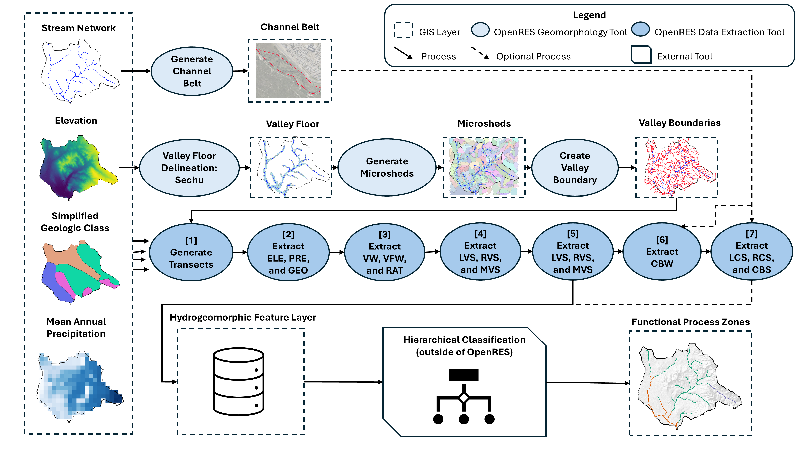

# Summary

Open Riverine Ecosystem Synthesis (`OpenRES`) is an open-source, modular, and GUI-accessible QGIS plugin that automates the extraction of key hydrogeomorphic features needed for Functional Process Zone (FPZ) classification of river networks. FPZs represent recurring hydrogeomorphic units within river corridors that operate at the reach-to-valley scale. Accurate classification and mapping of these zones are essential for evaluating how spatial variations in hydrogeomorphic structure influence ecological communities and ecosystem functioning within the Riverine Ecosystem Synthesis (RES) framework [@thorp_2006]. However, classification of FPZs has been constrained by the deprecation of standardized GIS tools such as RESonate [@williams_2013], which were commercial and proprietary, and by the continued absence of open-source alternatives capable of extracting the diverse hydrogeomorphic features required for FPZ classification across river networks at scale. This limitation has hindered reproducibility and comparability across studies seeking to test or extend the RES framework. By integrating reproducible methods within a widely adopted open-source GIS platform, `OpenRES` promotes standardization, accessibility, and scalability in riverine ecosystem analyses.

# Statement of need

The Riverine Ecosystem Synthesis (RES) reconceptualizes rivers as downstream mosaics of large, discrete, and repeating hydrogeomorphic patches [@thorp_2010] rather than continuous longitudinal gradients, such as those described by the popular River Continuum Concept [@vannote_1980]. These hydrogeomorphic patches, termed Functional Process Zones, arise from interactions between catchment geomorphology, hydrology, and climate and typically span 5–10 km sections of river [@thorp_2010]. FPZs describe differences in channel and valley structure, floodplain connectivity, and sediment and flow dynamics across watersheds, and have been linked to variation in fish and macroinvertebrate communities and ecosystem properties in rivers across five continents [@thorp_2023].

FPZ classification requires spatially consistent measures of climatic, geologic, and geomorphic features across a watershed, yet collecting these data in the field using “bottom-up” approaches is often impractical. Automated geospatial tools (i.e., “top-down” approaches) therefore play a critical role in enabling watershed scale classification of river networks. `OpenRES` was developed to meet this need by offering a unified, reproducible, and open-source workflow for extracting the hydrogeomorphic features required for FPZ delineation. `OpenRES` is intended for students, instructors, researchers, and practitioners in river science, geomorphology, hydrology, and ecosystem management who use QGIS and need a standardized, open-source tool to delineate FPZs and conduct studies of riverine ecosystems.

# State of the field

Early operationalization of the RES framework was advanced through the development of the RESonate toolbox by the U.S. Environmental Protection Agency (EPA) [@flotemersch_2010], which provided a workflow for deriving hydrogeomorphic attributes used to delineate FPZs [@williams_2013]. RESonate represented an important step toward translating RES theory into reproducible spatial analysis, enabling early applications of FPZ classification in large river systems. However, the tool was not broadly accessible to many researchers due to software availability constraints and reliance on proprietary ESRI environments (e.g. ArcMap).

OpenRES builds on this foundation by providing an open-source, publicly available implementation designed for the QGIS ecosystem. At present, it is the only openly available software specifically designed to extract the hydrogeomorphic variables required for FPZ classification within a modern, maintained geospatial platform. By lowering technical barriers to applying RES concepts, OpenRES facilitates broader evaluation of the ecological hypotheses proposed by the Riverine Ecosystem Synthesis, many of which remain underexplored due in part to the historical lack of accessible computational tools..

# Software design

`OpenRES` borrows from the software design and philosophy of the `RESonate` toolbox described in @williams_2013, with the intent of providing users with comparable functionality for extraction and calculation of hydrogeomorphic features (\autoref{fig:workflow}). However, OpenRES was developed specifically for the free and open-source QGIS ecosystem, relying only on core QGIS libraries and the natively available GRASS 7 geospatial processing engine. The software adopts a modular design in which individual tools are implemented as QGIS Processing algorithms, allowing users to execute components independently, integrate them into custom workflows, or adapt individual steps for alternative hydrogeomorphic feature definitions. By leveraging the QGIS Processing framework, OpenRES interoperates with other geospatial tools available within QGIS while maintaining minimal external dependencies, improving reproducibility and accessibility.

: Workflow for functional process zone classification using `OpenRES`. \label{fig:workflow}

## Data preparation

There are five required datasets and one optional dataset needed prior to the extraction of hydrogeomorphic features along a user's watershed of interest using `OpenRES` in QGIS:

Input GIS Layers (User provided)

-   Mean annual precipitation (raster)
-   Digital Elevation Model (\<= 30 m DEM, raster)
-   Simplified geologic class layer (i.e., alluvial, non-alluvial, bedrock; vector - polygon).
-   Stream network (vector - line)
-   Valley-boundary layer (vector - line)
-   (Optional) Channel belt layer (vector - line)

Here, there are two notable differences from `RESonate`. First, the stream network does not need to be “inverted” (i.e., stream direction moving from confluence to headwaters rather than the standard headwaters to confluence), which makes it much easier to use publicly available stream networks, such as the NHDPlusv2 dataset available in the United States [@nhdplusv2]. Second, the valley floor polygon and microsheds polygon layers needed for `RESonate` are replaced with a single valley-boundaries line layer to reduce the risk of erroneous calculations in the valley widths and side slopes calculation. `OpenRES` provides the tools to generate the valley-boundary layer and channel belt layer, which are covered in the next section.

## OpenRES functionality

`OpenRES` includes geomorphology utility tools to help users prepare the valley boundaries and channel belt layers required for subsequent feature extraction \autoref{tab:geomorph-tools}:

| Tool                             | Purpose                                                                                                                                    | Output                | GIS Data Type    |
| -------------------------------- | ------------------------------------------------------------------------------------------------------------------------------------------ | --------------------- | ---------------- |
| Generate Channel Belt            | Creates lateral offsets from the stream network to approximate the channel belt extent; intended for manual refinement.                    | Channel belt layer    | Vector (line)    |
| Valley Floor Delineation – Sechu | Identifies low-relief valley floor areas from a DEM using a slope-based cost accumulation method [@sechu_2021].                            | Valley floor layer    | Vector (polygon) |
| Generate Microsheds              | Generates microsheds using a threshold-based watershed approach (1–3 km² typical) to capture valley tops in confining valleys.             | Microshed layer       | Vector (polygon) |
| Create Valley Boundary           | Applies a difference operation between valley floor and microsheds and converts the result to a line layer representing valley boundaries. | Valley boundary layer | Vector (line)    |

: Geomorphology utility tools in `OpenRES` used to prepare channel belt and valley boundary inputs. \label{tab:geomorph-tools}

The core functionality of `OpenRES` is contained in seven data extraction tools, each of which is intended to be used sequentially to automate the extraction of fifteen hydrogeomorphic features \autoref{tab:openres-tools}:

| Step | Tool                      | Features      | Description                                                                                                                                        | Required |
| ---- | ------------------------- | ------------- | -------------------------------------------------------------------------------------------------------------------------------------------------- | -------- |
| [1]  | Generate Transects        | t_ID          | Generates perpendicular transects from river centerlines to valley boundaries, ensuring consistent sampling and linking outputs via a transect ID. | Yes      |
| [2]  | Extract ELE, PRE, and GEO | ELE, PRE, GEO | Samples elevation, precipitation, and geologic class from user provided datasets.                                                                  | Yes      |
| [3]  | Extract VW, VFW, and RAT  | VW, VFW, RAT  | Measures valley width and valley floor width from transects and computes their ratio.                                      | Yes      |
| [4]  | Extract LVS, RVS, and MVS | LVS, RVS, MVS | Computes left, right, and mean valley slopes from elevation differences along transects.                                                           | Yes      |
| [5]  | Extract DVS and SIN       | DVS, SIN      | Calculates down valley slope and river sinuosity from segment geometry.                                                                            | Yes      |
| [6]  | Extract CBW               | CBW           | Measures channel belt width from transect intersections with the channel belt layer.                                                               | Optional |
| [7]  | Extract LCS, RCS, and CBS | LCS, RCS, CBS | Quantifies within belt channel sinuosity on each side and summarizes with a mean value.                                                            | Optional |

: Core `OpenRES` data extraction workflow. \label{tab:openres-tools}

The resulting dataset contains up to 15 standardized metrics that collectively describe longitudinal and lateral hydrogeomorphic variation along the river corridor \autoref{tab:featuretable}.

| Feature | Name                    | Hydrogeomorphic role                            |
| ------- | ----------------------- | ----------------------------------------------- |
| ELE     | Elevation               | Longitudinal position and energy gradient       |
| PRE     | Precipitation           | Hydroclimatic setting                           |
| GEO     | Geology                 | Substrate and structural control                |
| VW      | Valley Width            | Lateral accommodation space at the valley scale |
| VFW     | Valley Floor Width      | Floodplain/low relief valley floor extent       |
| RAT     | VW:VFW Ratio            | Relative valley confinement                     |
| LVS     | Left Valley Slope       | Left side valley confinement                    |
| RVS     | Right Valley Slope      | Right side valley confinement                   |
| MVS     | Mean Valley Slope       | Overall valley confinement                      |
| DVS     | Down Valley Slope       | Longitudinal channel gradient                   |
| SIN     | River Sinuosity         | Planform complexity of the river                |
| CBW     | Channel Belt Width      | Active channel belt extent                      |
| LCS     | Left Channel Sinuosity  | Left side within-belt planform curvature        |
| RCS     | Right Channel Sinuosity | Right side within-belt planform curvature       |
| CBS     | Channel Belt Sinuosity  | Mean within-belt planform curvature             |

: Hydrogeomorphic features available for extraction across a watershed in OpenRES. \label{tab:featuretable}

## After OpenRES: unsupervised classification

The extracted attributes from `OpenRES` can be joined to the river network output from **[1] Generate Transects:** by using `t_ID` as the joining feature, then exported to Python, R, or another software for hierarchical clustering analyses commonly used to delineate FPZs [@maasri_2019; @elgueta_2019]. To assist users in this process, we developed a separate Shiny app in R, ShinyFPZ, which contains common methods for FPZ classification as well as visualization tools for OpenRES output data [@nesslage_2026]. For users preferring to stay in the QGIS environment for this step, there are also QGIS plugins that contain the appropriate capabilities, such as the Attribute based clustering plugin [@kazakov_2025]. This workflow enables reproducible, cross-watershed FPZ classification and supports testing of RES hypotheses regarding linkages among hydrogeomorphic structure, ecological composition, and ecosystem function [@thorp_2023].

# Research impact statement

`OpenRES` is the first free and open-source implementation of a complete hydrogeomorphic feature extraction workflow for FPZ classification. Unlike legacy tools such as `RESonate`, which depend on commercial GIS software, `OpenRES`:

-   operates in a modern, actively maintained FOSS GIS platform,
-   provides a modular and extensible architecture, and
-   enables complete and reproducible workflows across watersheds

By lowering technical and software barriers, `OpenRES` facilitates broader adoption of the RES framework in river science and ecosystem studies. `OpenRES` has supported growing adoption of standardized workflows for extracting hydrogeomorphic features used in FPZ classification under the RES framework. Since its release, the software has been downloaded thousands of times from the official QGIS repository and has been cloned hundreds of times from the GitHub repository. On the applications side, `OpenRES` is being utilized in environmental DNA-based watershed studies across the state of California [@stavros_2023; @nesslage_2024], as well as in South Africa's Greater Cape Floristic Region as part of NASA's Biodiversity Survey of the Cape (BioSCape) [@cardoso_2025]. These applications indicate demand for reproducible, open-source tools capable of supporting consistent FPZ analyses across river networks.

# AI usage disclosure

AI (specifically, ChatGPT 4 and 5) was used to aid in development of the `OpenRES` source code.

AI-assisted language editing was used to improve wording in parts of the manuscript.

All code and text generated or modified by AI was proofread by the authors and AI generated code was also tested comprehensively.

# Acknowledgements

`OpenRES` was developed by members of the Earth Observation and Remote Sensing Laboratory at the University of California, Merced. The authors would like to thank Matthew Rossi, Rachel S. Meyer, E. Natasha Stavros, Madeline Slimp, Meghan T. Hayden, Will Varela, and Martin C. Thoms for their feedback, suggestions, and support during the development of `OpenRES`.

# References
